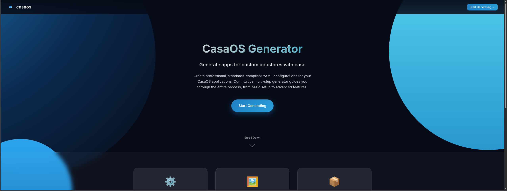
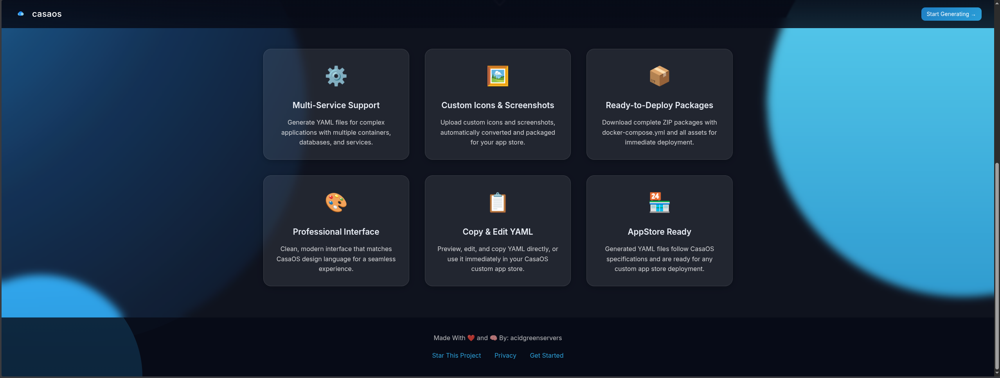
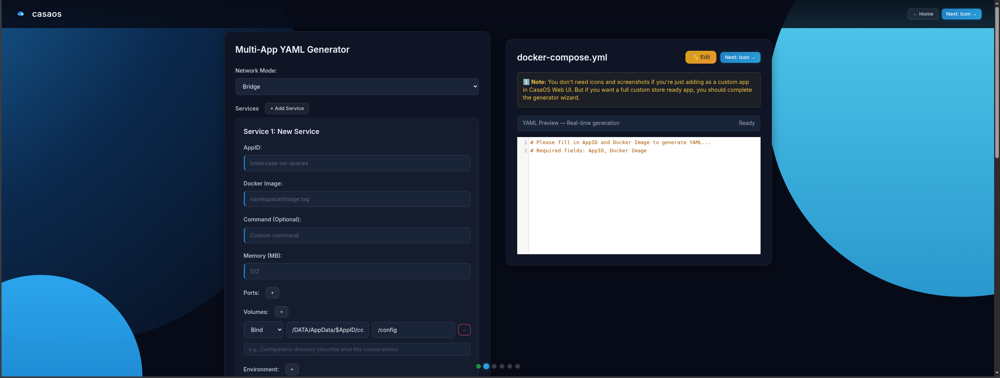
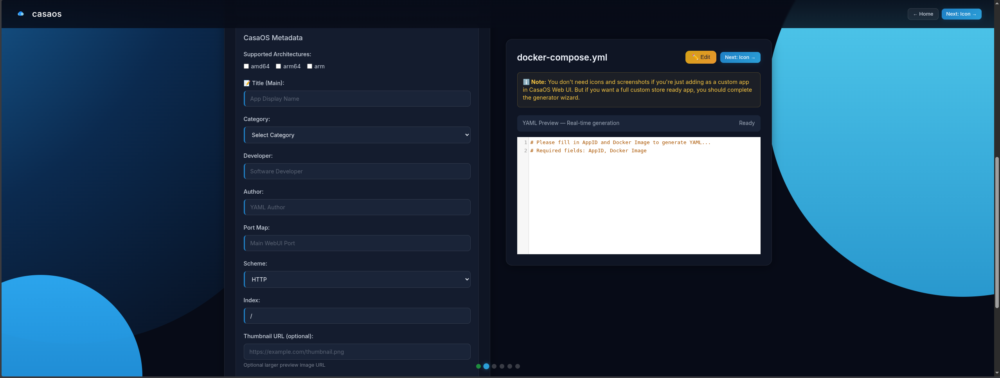
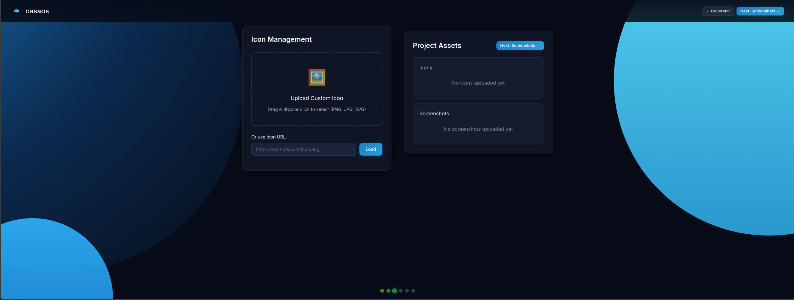
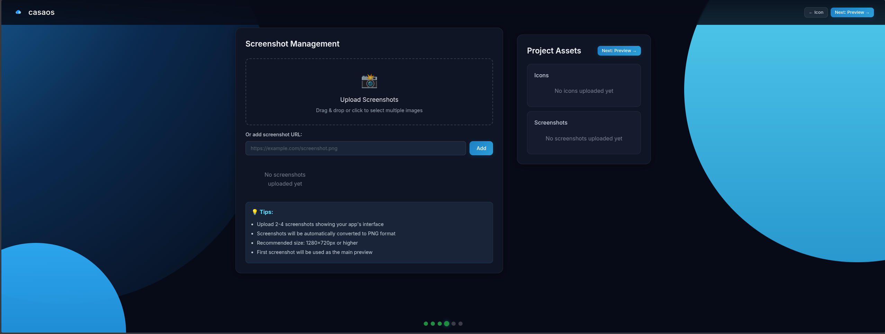
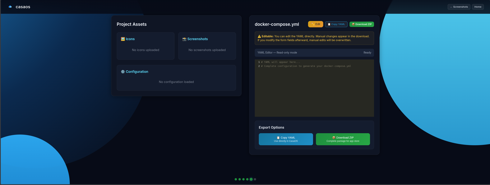

# CasaOS Generator 🚀

[](https://github.com/acidgreenservers/CasaOS-Generator)
[](LICENSE)

**CasaOS Generator** is a professional, 100% client-side utility designed to help you create standards-compliant YAML configurations for custom CasaOS appstores with ease.

## ✨ Features

- **100% Client-Side**: Your data never leaves your device. All generation and processing happen in your browser.
- **Intuitive Workflow**: A multi-step generator guides you from basic setup to advanced features (volumes, ports, environment variables).
- **Live Preview**: Real-time YAML generation with syntax highlighting via CodeMirror.
- **ZIP Export**: Download your completed configuration as a ready-to-use ZIP package.
- **Modern UI**: A sleek, dark-themed interface built for clarity and efficiency, following professional design standards.
- **Privacy First**: Zero cookies, zero tracking, and zero data collection.

## 🛠️ Tech Stack

- **Frontend**: HTML5, CSS3 (Custom Design System), Vanilla JavaScript.
- **Typography**: [Inter](https://fonts.google.com/specimen/Inter) via Google Fonts.
- **Libraries**:
    - [js-yaml](https://github.com/nodeca/js-yaml) — Client-side YAML parsing and generation.
    - [CodeMirror](https://codemirror.net/) — Professional code editor interface.
    - [JSZip](https://stuk.github.io/jszip/) — Client-side ZIP file generation.

## 🚀 Quick Start

Since this is a static client-side application, there is no installation required!

1. **Clone the repository**:
   ```bash
   git clone https://github.com/acidgreenservers/CasaOS-Generator.git
   ```
2. **Open `index.html`**:
   Simply open the `index.html` file in any modern web browser.
3. **Start Generating**:
   Follow the on-screen steps to build your CasaOS app configuration.

## 📸 Screenshots

<details>
<summary><strong>View Gallery</strong> — Click to expand and see the application in action</summary>

### Landing Page



### Generator Steps
**Step 1 - Basic Configuration**



**Step 2 - Volumes & Ports**


**Step 3 - Advanced Options**


**Step 4 - Review & Export**


</details>

## 📂 Project Structure

- `index.html`: The landing page and entry point.
- `pages/`: Contains the core generator application.
- `css/`: The centralized design system and base styles.
- `modules/`: Modular JavaScript logic for YAML generation and ZIP handling.
- `docs/`: Documentation and legal notices (e.g., Privacy Notice).

## 🔒 Privacy & Security

We take your privacy seriously.
- **No Data Collection**: We do not store, track, or analyze your data.
- **Local Storage**: We use `localStorage` only to save your current work-in-progress and notification preferences locally on your machine.
- **Open Source**: The code is fully auditable. Review the [PRIVACY.md](./PRIVACY.md) or [docs/privacy-notice.html](./docs/privacy-notice.html) for more details.

## 🤝 Contributing

Contributions are welcome! Please see [AGENTS.md](./AGENTS.md) for development guidelines and our [ROADMAP.md](./ROADMAP.md) for planned features.

## 📄 License

This project is licensed under the MIT License - see the [LICENSE](./LICENSE) file for details.

---

Built with ❤️ for the CasaOS community by [acidgreenservers](https://github.com/acidgreenservers).
